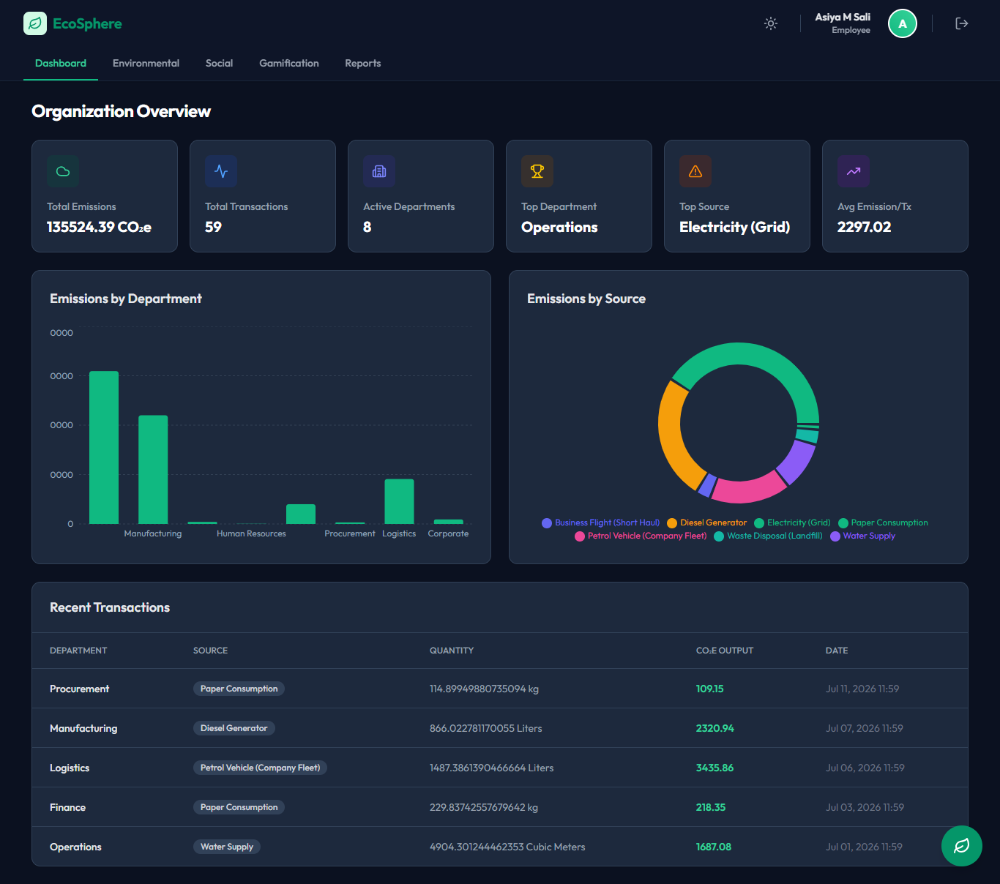
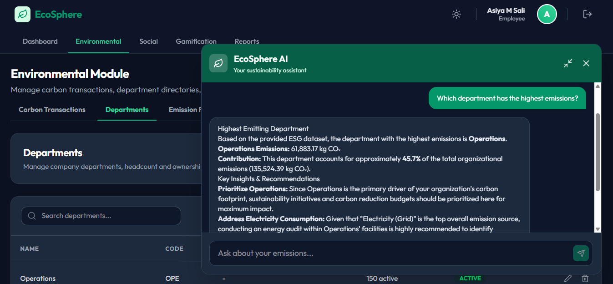
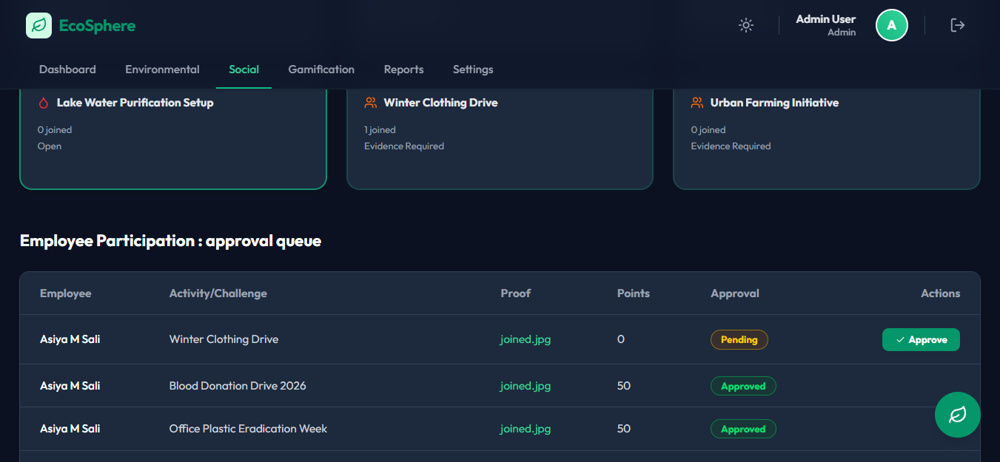
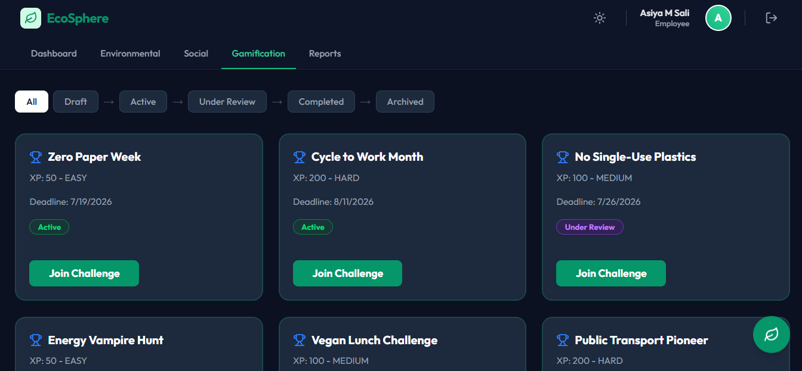

# EcoSphere: AI-Powered ESG Management Platform 🌿

EcoSphere is a comprehensive, AI-driven Environmental, Social, and Governance (ESG) Management Platform designed to help organizations seamlessly track, analyze, and optimize their sustainability goals. Built with a robust FastAPI backend and a premium, responsive React frontend, it leverages advanced generative AI to provide real-time, actionable insights into corporate sustainability.

## 📸 Screenshots

| Dashboard Overview | Environmental AI Chatbot |
|:---:|:---:|
|  |  |

| Admin Approval Queue | Gamification Challenges |
|:---:|:---:|
|  |  |

---

## 🚀 Key Features
### 🏢 Core Management
*   **Secure Authentication:** JWT-based user registration and login flows.
*   **Organizational Setup:** Manage departments, emission categories, and custom emission factors.
*   **Interactive Dashboard:** High-level summary of total emissions, top emitting departments, and active CSR activities, beautifully visualized using interactive charts.

### 🌱 Environmental Pillar
*   **Carbon Transactions:** Track and calculate CO₂e output in real-time based on activity quantity and customizable emission factors.
*   **Emission Source Tracking:** Breakdown of emissions by source (e.g., electricity, fuel) and department.

### 🤝 Social Pillar
*   **CSR Activity Management:** Track Corporate Social Responsibility activities with statuses (Planned, Ongoing, Completed, Cancelled).

### ⚖️ Governance Pillar
*   **Policy Tracking:** Manage ESG and compliance policies through their lifecycles (Draft, Active, Archived).

### 📊 Comprehensive Reports Module
*   **ESG Summary Reports:** Aggregates Environmental, Social, and Governance metrics into a single unified reporting dashboard.

### ✨ EcoSphere AI Copilot (Powered by Gemini)
*   **Context-Aware Assistant:** Chat with your live ESG data. The AI dynamically loads your dashboard data to answer queries accurately.
*   **Executive ESG Reports:** Automatically generates highly structured Executive Reports featuring:
    *   🟢 Overall ESG Health Scores
    *   Top Strengths & Risks
    *   Priority Action items
    *   Relevant Sustainable Development Goals (SDGs) like 🌍 SDG 7, 🌱 SDG 12
*   **Domain Guardrails:** Strictly constrained to only answer questions regarding EcoSphere and ESG topics, guaranteeing professional operation.

---

## 🛠️ Detailed Technology Stack

### Backend
*   **Language:** Python 3.8+
*   **Framework:** FastAPI (High performance, async-ready)
*   **Database ORM:** SQLAlchemy (with SQLite/PostgreSQL support)
*   **Data Validation:** Pydantic
*   **Authentication:** JWT (JSON Web Tokens) & Passlib (Bcrypt)
*   **AI Integration:** Google Generative AI (Gemini API)
*   **Server:** Uvicorn

### Frontend
*   **Library:** React
*   **Build Tool:** Vite (Lightning fast HMR)
*   **Styling:** Tailwind CSS (Utility-first CSS framework)
*   **Data Fetching:** TanStack React Query (Automatic caching and background updates)
*   **Routing:** React Router DOM
*   **Data Visualization:** Recharts (Composable charting library)
*   **Icons & Markdown:** Lucide React, React Markdown

---

## 🚀 Getting Started (How to Run)

Follow these instructions to get a copy of the project up and running on your local machine for development and testing purposes.

### Prerequisites

Ensure you have the following installed:
*   [Python 3.8+](https://www.python.org/downloads/)
*   [Node.js (v16+) & npm](https://nodejs.org/)
*   A [Google Gemini API Key](https://aistudio.google.com/) for the AI Copilot.

### 1. Clone the Repository

```bash
git clone https://github.com/Athi183/EcoSphere-ESG_Management_Platform.git
cd EcoSphere-ESG_Management_Platform
```

### 2. Backend Setup

Open a new terminal and navigate to the `backend` folder:

```bash
cd backend
```

**Create and activate a virtual environment:**
*   **Windows:** `python -m venv venv` and `venv\Scripts\activate`
*   **Mac/Linux:** `python3 -m venv venv` and `source venv/bin/activate`

**Install dependencies:**
```bash
pip install -r requirements.txt
```

**Configure Environment Variables:**
Create a `.env` file in the `backend` directory and add your API keys and configuration:
```env
# backend/.env
GOOGLE_API_KEY=your_gemini_api_key_here
SECRET_KEY=your_secret_key_here
ALGORITHM=HS256
ACCESS_TOKEN_EXPIRE_MINUTES=1440
```

**Run the backend server:**
```bash
uvicorn app.main:app --reload
```
The backend API will be available at `http://localhost:8000`. You can view the full Swagger documentation at `http://localhost:8000/docs`.

### 3. Frontend Setup

Open another terminal and navigate to the `frontend` folder:

```bash
cd frontend
```

**Install dependencies:**
```bash
npm install
```

**Configure Environment Variables:**
Create a `.env` file in the `frontend` directory:
```env
# frontend/.env
VITE_API_URL=http://localhost:8000
```

**Run the frontend development server:**
```bash
npm run dev
```
The frontend application will be available at `http://localhost:5173`.

---

## 👥 The Team

Meet the brilliant minds behind EcoSphere:

*   **Asiya Muhammed Sali** — *Backend Developer*
*   **Athira V** — *Frontend Developer*
*   **Fathima Mehrin V S** — *Frontend and AI Developer*

---

## ⭐ Support Us!

If you found this project useful, inspiring, or helpful in your own sustainability journey, **please give it a star on GitHub!** It helps us a lot! 🌟
